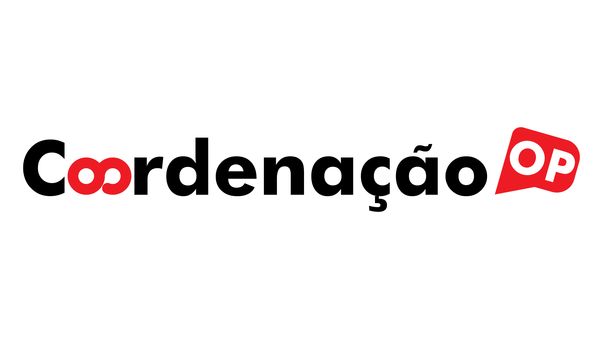

  

# CoordenacaoOP

Software de apoio à coordenação pedagógica para organizar turmas, importar dados e gerar documentos de conselho de classe.

## O que o aplicativo faz

- cadastra e gerencia turmas
- importa alunos por CSV
- importa mapões FGB e IF
- registra encaminhamentos por aluno em cada conselho
- gera ata de conselho em `.docx`
- gera relatório para professores em `.docx`
- verifica atualizações pelo menu `Ajuda > Verificar atualizacoes`

## Para quem ele foi pensado

O aplicativo foi pensado para uso prático no cotidiano da coordenação pedagógica, com foco em reduzir trabalho manual na preparação e no registro dos conselhos de classe.

## Como baixar

As versões prontas para uso ficam na página de Releases do GitHub:

<https://github.com/thenriques45-dot/coordenacao-op/releases>

Arquivos publicados:

- Windows: `CoordenacaoOP-windows.zip`
- Linux: `CoordenacaoOP-x86_64.AppImage`

## Como usar no Windows

1. Baixe o arquivo `CoordenacaoOP-windows.zip` da versão desejada.
2. Extraia o conteúdo do `.zip` para uma pasta.
3. Execute o arquivo `CoordenacaoOP.exe`.

Observação:
Sem assinatura digital, o Windows pode exibir alerta do SmartScreen ao abrir o programa.

## Como usar no Linux

1. Baixe o arquivo `CoordenacaoOP-x86_64.AppImage`.
2. Dê permissão de execução ao arquivo.
3. Execute o AppImage.

## Sobre o desenvolvimento

Este projeto é desenvolvido com forte uso de vibe coding: a evolução do software acontece com apoio intenso de IA, sempre com revisão, testes e ajustes práticos orientados pelo uso real do aplicativo.

## Informações técnicas

Se você pretende rodar o projeto a partir do código-fonte:

- Python 3.11+ (recomendado 3.12)
- dependências em `requirements.txt`
- execução principal por `python main_gui.py`

## Licença

Este projeto é distribuído sob a licença **GPL-3.0-or-later**. Veja [LICENSE](LICENSE).

## Documentos adicionais

- Segurança: [SECURITY.md](SECURITY.md)
- Contribuição: [CONTRIBUTING.md](CONTRIBUTING.md)
- Código de conduta: [CODE_OF_CONDUCT.md](CODE_OF_CONDUCT.md)
