# Manual de uso do CoordenacaoOP

Versão de referência: 2.1.2

> As imagens deste manual usam dados fictícios e servem como referência visual da interface. Não compartilhe prints com dados reais de alunos, especialmente informações de elegibilidade ou deficiência.

## Recomendações rápidas

- Faça backup antes de grandes importações.
- Confira sempre a prévia antes de aplicar importações de mapões.
- Trate informações de alunos elegíveis como sigilosas.
- Na tela de conselho, exponha apenas a tag **Aluno elegível**, nunca a lista de deficiências.
- Ao terminar o conselho, revise o texto da ata antes de gerar os documentos.

## Como baixar o CoordenacaoOP pelo GitHub

O CoordenacaoOP é distribuído pela página de releases do GitHub. Use sempre o link da versão mais recente:

https://github.com/thenriques45-dot/coordenacao-op/releases/latest

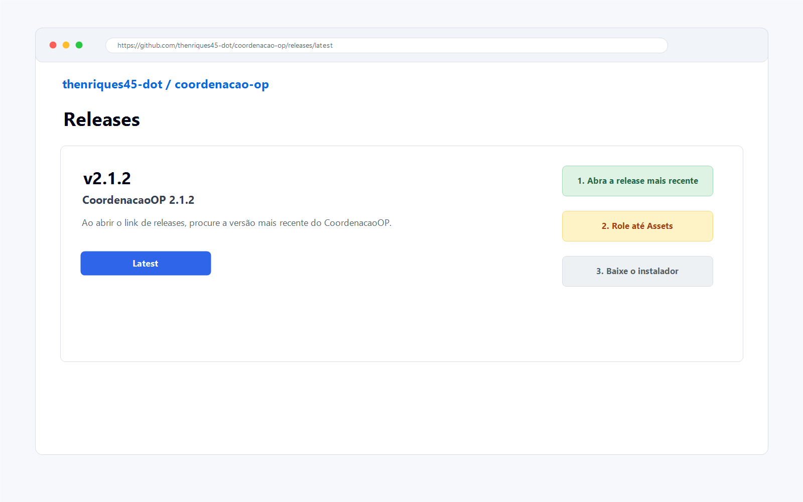

Passo a passo:
1. Abra o link acima no navegador.
2. Procure a release marcada como mais recente.
3. Role a página até a área **Assets**.
4. Baixe o arquivo adequado ao seu computador.

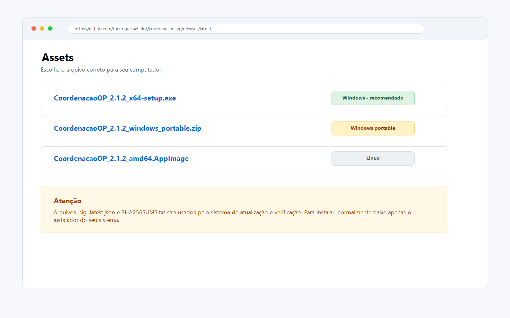

Qual arquivo baixar:
1. **Windows - recomendado:** baixe `CoordenacaoOP_versao_x64-setup.exe`.
2. **Windows portable:** baixe `CoordenacaoOP_versao_windows_portable.zip` se quiser usar sem instalação tradicional.
3. **Linux:** baixe `CoordenacaoOP_versao_amd64.AppImage`.
4. Os arquivos `.sig`, `latest.json` e `SHA256SUMS.txt` são usados pelo atualizador e por verificações técnicas. Em geral, o usuário comum não precisa baixá-los manualmente.

Depois do download no Windows:
1. Abra o arquivo `.exe` baixado.
2. Se o Windows mostrar uma tela de proteção, confirme que deseja executar o instalador apenas se o arquivo veio da página oficial do GitHub.
3. Conclua a instalação.
4. Abra o CoordenacaoOP pelo menu iniciar ou pelo atalho criado.

## 1. O que é o CoordenacaoOP

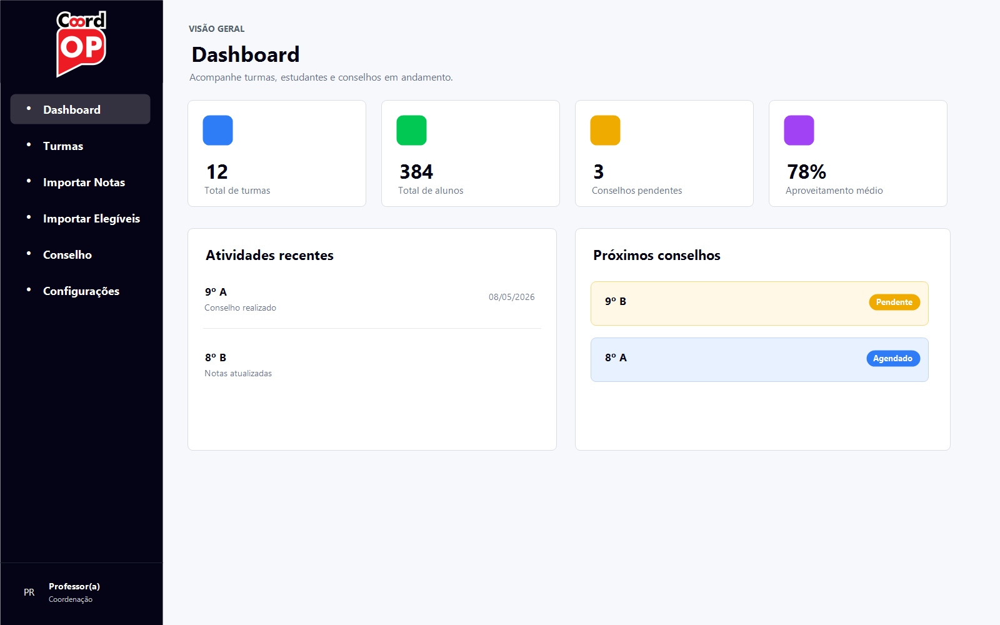

O CoordenacaoOP é um aplicativo de apoio à coordenação pedagógica e ao conselho de classe. Ele reúne turmas, alunos, notas, faltas, encaminhamentos, atas e relatórios em uma única interface.
A tela inicial apresenta um painel geral com totais da escola, atividades recentes e próximos conselhos. Ela serve como ponto de partida para navegar pelas principais funções.

Passo a passo:
1. Use a barra lateral escura para alternar entre Dashboard, Turmas, Importar Notas, Importar Elegíveis, Conselho e Configurações.
2. Os cartões do Dashboard ajudam a ter uma visão rápida do andamento dos conselhos e das turmas cadastradas.

## 2. Gestão de turmas

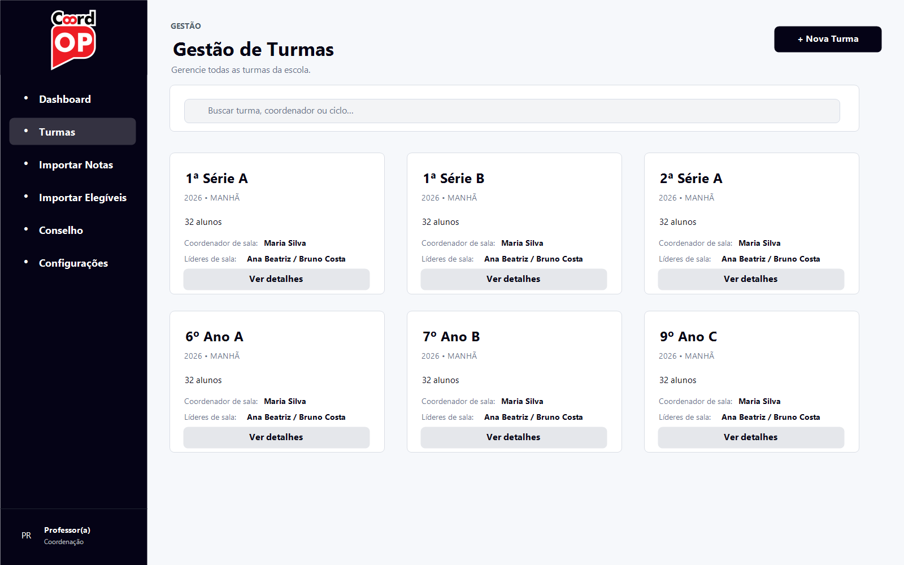

A tela de Gestão de Turmas concentra todas as salas cadastradas. Cada cartão mostra dados essenciais: série, período, quantidade de alunos, coordenador de sala e líderes da turma.
É possível buscar turmas pelo nome, filtrar por ciclo e criar turmas individualmente ou em lote.

Passo a passo:
1. Clique em Nova Turma para cadastrar uma sala individual.
2. Use Criar salas em lote quando houver vários CSVs, um por letra de turma.
3. Clique em Ver detalhes para abrir a gestão completa da turma.

## 3. Gestão da turma e lista de alunos

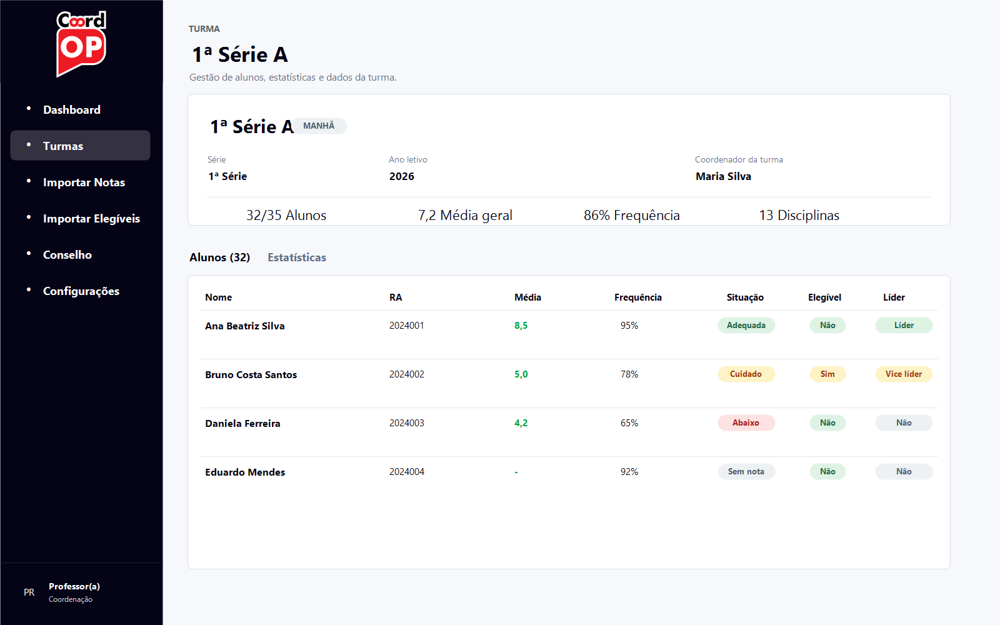

Ao abrir uma turma, o sistema exibe os dados gerais da sala e a lista de alunos. Nessa tela é possível conferir RA, média, frequência, situação, elegibilidade e liderança de sala.
A coluna Elegível indica alunos que precisam de atenção específica. A coluna Líder permite marcar líder e vice-líder da sala.

Passo a passo:
1. Clique no nome do coordenador da turma para editar essa informação.
2. Na coluna Elegível, altere manualmente entre Sim e Não quando necessário.
3. Na coluna Líder, clique para alternar entre Não, Líder e Vice líder. O sistema permite apenas um líder e um vice por turma.
4. Clique no aluno para abrir a tela individual com notas por disciplina, frequência e parecer do conselho.

## 4. Importar notas dos mapões

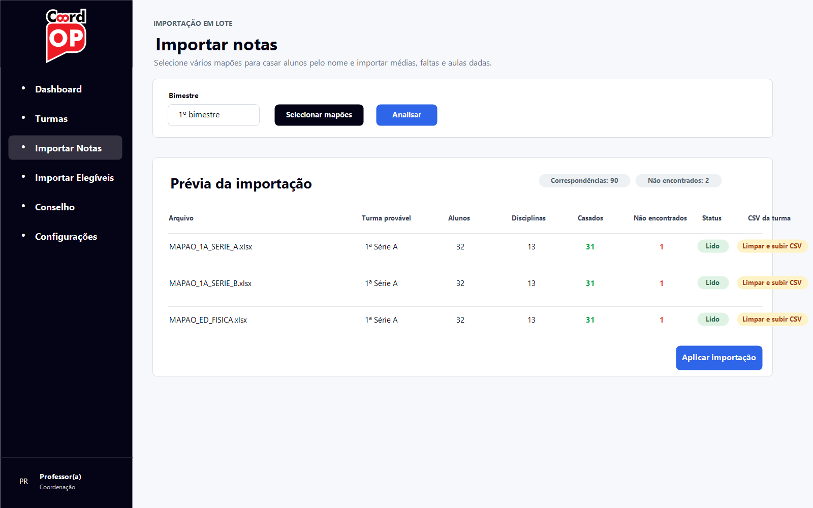

A função Importar Notas permite selecionar vários mapões ao mesmo tempo. O sistema tenta identificar a turma correspondente e casar os alunos pelo nome.
A prévia mostra quantos alunos foram lidos, quantas disciplinas foram encontradas, quantas correspondências foram feitas e se há alunos não encontrados ou duplicados.

Passo a passo:
1. Escolha o bimestre correto antes de importar.
2. Clique em Selecionar mapões e selecione os arquivos .xlsx.
3. Clique em Analisar para visualizar a prévia.
4. Se houver erro de CSV da turma, use Limpar e subir CSV na própria linha do mapão.
5. Depois de conferir os dados, clique em Aplicar importação.

## 5. Importar alunos elegíveis

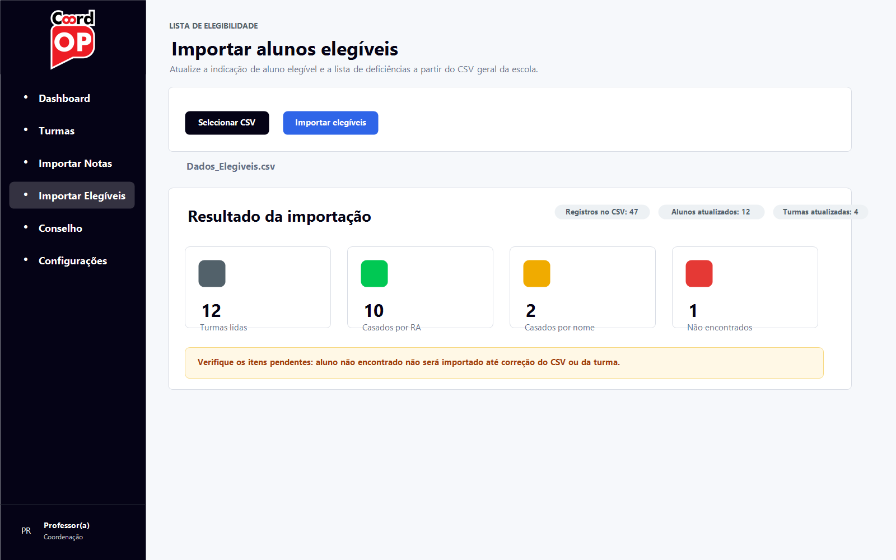

A função Importar Elegíveis atualiza a indicação de alunos elegíveis e salva a lista de deficiências do aluno na gestão da turma. Essa informação é administrativa e deve ser tratada com sigilo.
Na tela de conselho, o programa mostra apenas a tag Aluno elegível. A lista de deficiências não aparece para estudantes ou responsáveis.

Passo a passo:
1. Clique em Importar Elegíveis na barra lateral.
2. Selecione o CSV geral da escola.
3. Clique em Importar elegíveis.
4. Confira o resultado: registros lidos, turmas atualizadas, alunos casados por RA, alunos casados por nome e não encontrados.
5. Se houver alunos não encontrados, confira se a turma existe, se o RA está correto e se o nome social está igual ao cadastro da turma.

## 6. Tela de conselho

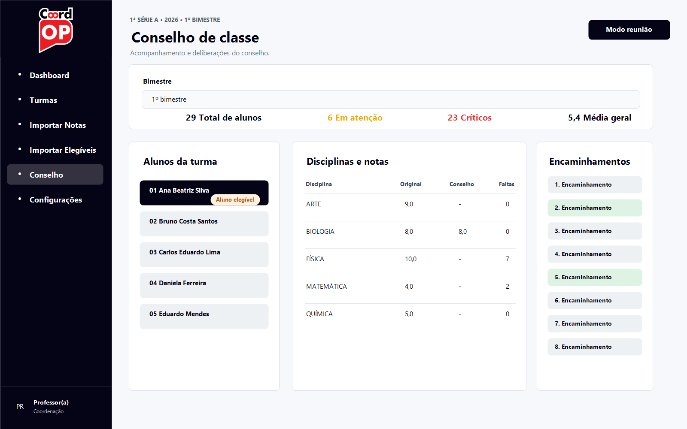

A tela de conselho organiza os alunos, as disciplinas e os encaminhamentos. Ela foi pensada para apoiar a reunião sem expor informações sensíveis além do necessário.
Alunos elegíveis aparecem identificados apenas com a tag Aluno elegível. As notas abaixo da média, em cuidado ou sem nota usam cores diferentes para facilitar a leitura.

Passo a passo:
1. Selecione o bimestre no campo superior.
2. Clique no aluno na lista lateral para consultar suas disciplinas.
3. Dê duplo clique no traço da coluna Conselho para registrar ajuste de nota.
4. Clique nos encaminhamentos para marcar ou desmarcar as deliberações do conselho.
5. Use as cores das pílulas para identificar rapidamente Adequada, Cuidado, Abaixo e Sem nota.

## 7. Modo reunião

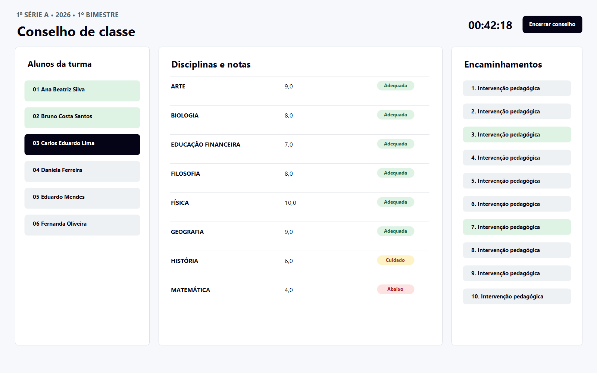

O Modo reunião amplia a área útil da tela de conselho, remove a navegação lateral e inicia um cronômetro. Ele é indicado para projeção durante o conselho de classe.
O tempo de reunião é salvo. Se o conselho continuar em outro dia, o cronômetro soma o tempo já transcorrido.

Passo a passo:
1. Clique em Modo reunião na tela de conselho.
2. Use a lista lateral para selecionar os alunos deliberados.
3. Ao concluir, clique em Encerrar conselho para abrir a finalização.
4. Alunos já deliberados ficam marcados visualmente para evitar retrabalho durante a reunião.

## 8. Finalizar conselho, ata e relatório

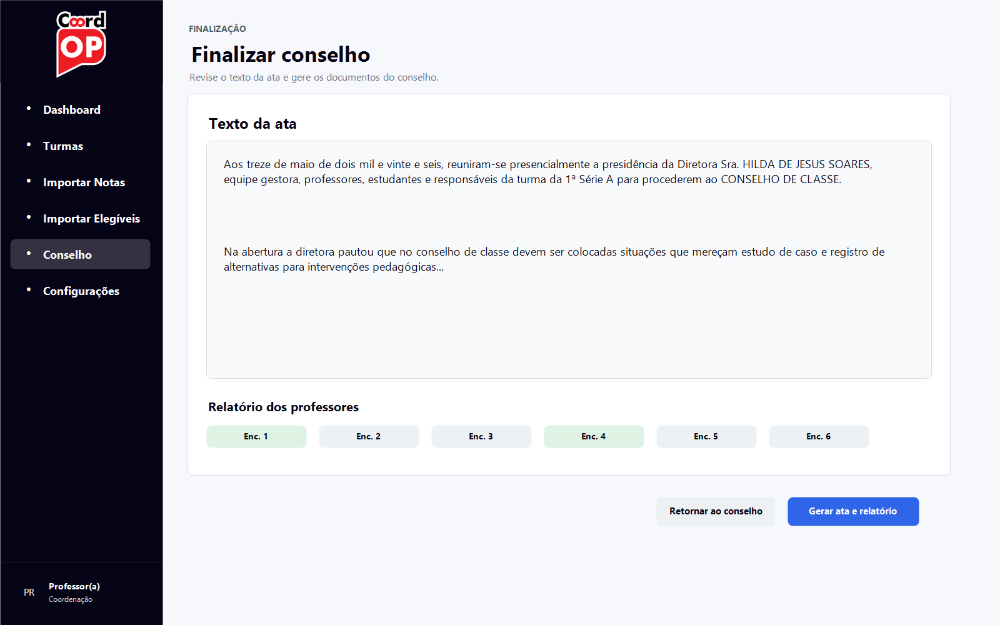

Na finalização, o sistema apresenta o texto da ata para revisão. Esse texto pode ser editado livremente antes da geração dos documentos.
Ao finalizar, o programa gera a ata e o relatório dos professores nas pastas de relatórios, organizadas por ano, ciclo/série e bimestre.

Passo a passo:
1. Revise o texto da ata antes de gerar os documentos.
2. Selecione os encaminhamentos que devem aparecer no relatório dos professores.
3. Clique em Gerar ata e relatório.
4. Depois de gerados, os botões na tela de conselho permitem abrir a ata e o relatório para conferência ou impressão.

## 9. Configurações, backup e atualização

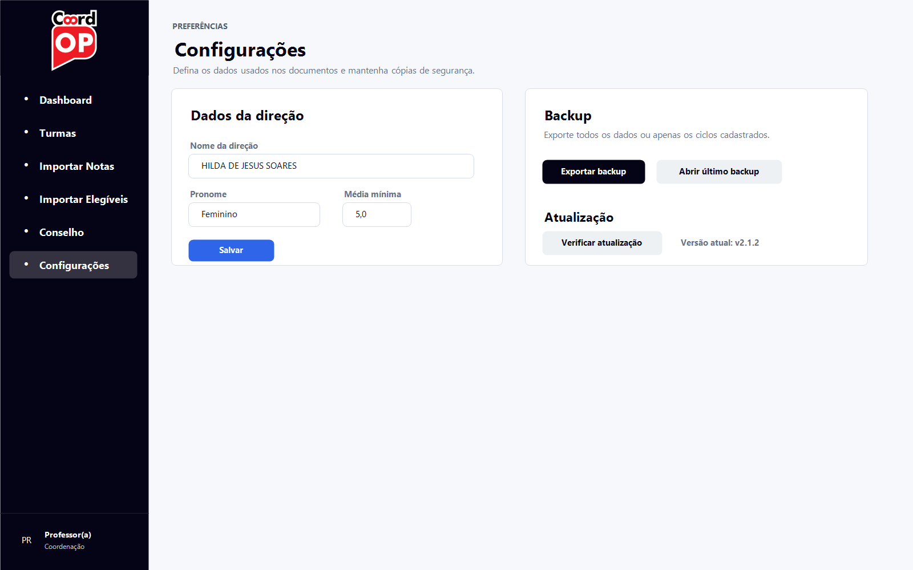

A tela de Configurações reúne os dados usados na ata, opções de backup e verificação de atualização.
O nome e o gênero da direção são usados para montar automaticamente o texto da ata. A média mínima define o critério usado nas situações de nota.

Passo a passo:
1. Preencha o nome da direção e selecione o pronome adequado.
2. Confira a média mínima usada pela escola.
3. Use Exportar backup para salvar uma cópia dos dados.
4. Quando necessário, use backup seletivo por ciclo para exportar apenas parte dos dados.
5. Use Verificar atualização para buscar uma versão nova publicada no GitHub.

## Boas práticas de uso

- Mantenha os CSVs de turma atualizados ao longo do ano.
- Reimporte mapões quando houver correção de notas ou recuperação.
- Use nomes sociais nos cadastros de turma quando constarem nos registros escolares.
- Evite projetar telas administrativas com informações sensíveis.
- Guarde backups em local seguro, especialmente antes de trocar de computador ou pendrive.

## Fluxo sugerido para o conselho

1. Criar ou atualizar as turmas.
2. Importar os mapões do bimestre.
3. Importar a lista de alunos elegíveis, se houver atualização.
4. Conferir a tela de gestão da turma.
5. Abrir o conselho e usar o modo reunião.
6. Deliberar alunos e encaminhamentos.
7. Encerrar o conselho, revisar a ata e gerar documentos.
8. Fazer backup após a finalização.